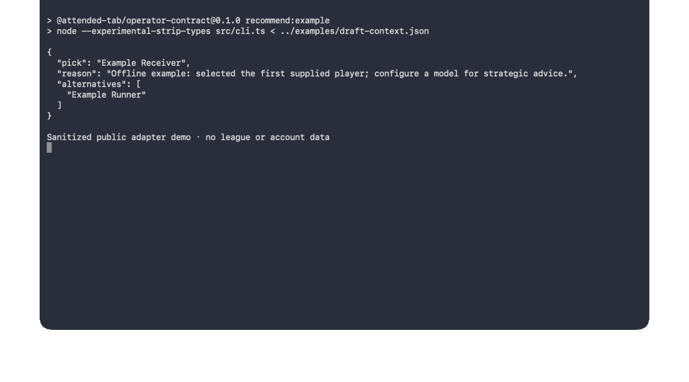

# Draft Day Cockpit

Draft Day Cockpit is a local-first fantasy-football draft assistant for macOS. It reads the Yahoo
draft room the owner is already attending, keeps recommendations tied to the observed room and turn,
and fails closed when browser or room identity is uncertain.

This competition repository presents the product, its privacy boundary, and selected runnable seams
without publishing the private recommendation engine, league data, room evidence, or product history.
Attended Tab Operator is one browser-safety feature inside that larger product.

The first public bug preserved here was subtle: the Chrome launcher could safely reactivate a live process
or cold-start after termination, but its caller treated a completed launch request as permanent proof
that Chrome still existed. Closing Chrome left the product disconnected while every later Open action
was ignored.

## What is public

- The macOS Chrome launch plan and idempotent launcher.
- The launch-request state rule that allows revalidation after a completed request.
- The attended-source recovery message used when no selected Yahoo tab is connected.
- Sanitized unit tests with invented process IDs and no browser data.
- A provider-neutral recommendation contract for local OpenAI-compatible servers and optional
  frontier APIs, with output constrained to the supplied available-player list.
- A competition-facing product overview, architecture boundary, demo path, and reviewer questions.

See [PUBLIC_BOUNDARY.md](docs/PUBLIC_BOUNDARY.md) for the exact line between this repository and the
private product.

- [Product overview](docs/PRODUCT_OVERVIEW.md)
- [Architecture](docs/ARCHITECTURE.md)
- [Demo path](docs/DEMO.md)
- [Privacy](docs/PRIVACY.md)
- [Model providers](docs/MODEL_PROVIDERS.md)

## Run the tests

Requirements: macOS 14 or newer, Xcode 16 or newer, and Node 22 or newer.

```bash
swift test
cd node && npm test
node ../scripts/check-public-boundary.mjs ..
```

The Node package has no dependencies; `npm test` only invokes Node's built-in test runner. The
private product uses pnpm, but this standalone public fixture deliberately avoids installing a
package manager or dependency tree.



## Questions for reviewers

1. Is there a stronger macOS signal than checking `NSRunningApplication.isTerminated`, open AX
   windows, the Chrome process arguments, and the profile `SingletonLock` together?
2. Can `NSWorkspace.openApplication` reopen a window for an existing custom-user-data Chrome process
   without ever creating a second profile process or sending the lobby URL twice?
3. Which lifecycle transitions should be modeled explicitly so a UI status never becomes stale
   authority again?

Please use invented URLs and identifiers in issues. Do not attach Chrome profiles, cookies, headers,
page bodies, Yahoo account details, or real league and room IDs.

## License

MIT. See [LICENSE](LICENSE).
